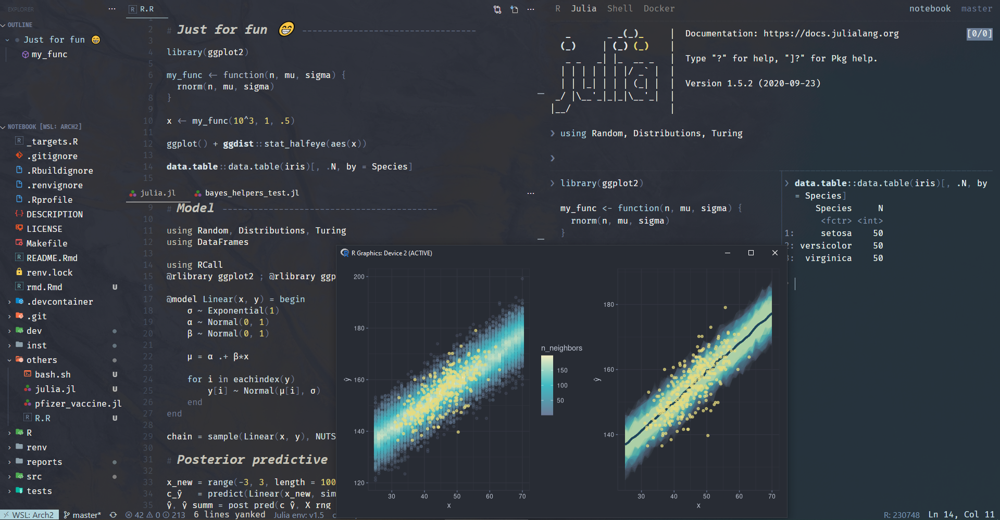
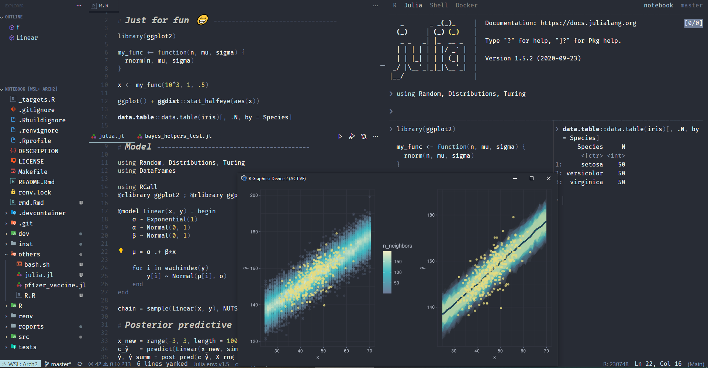
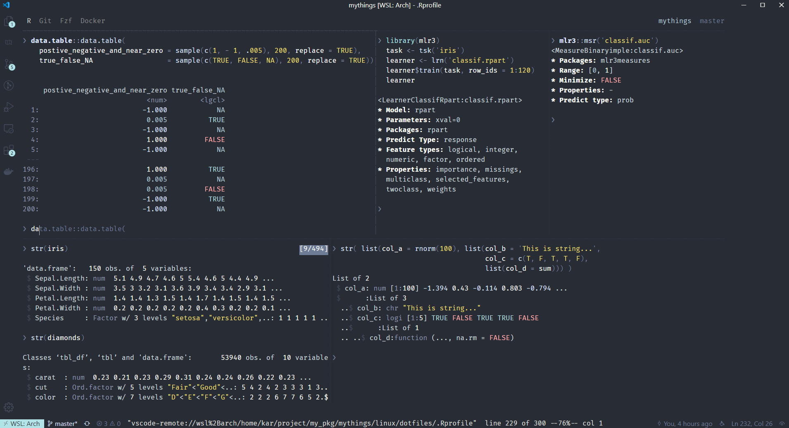
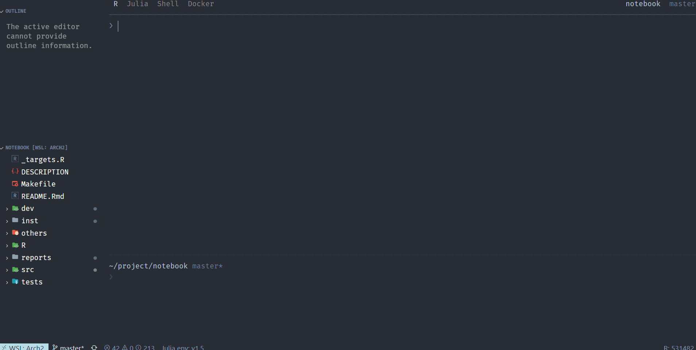
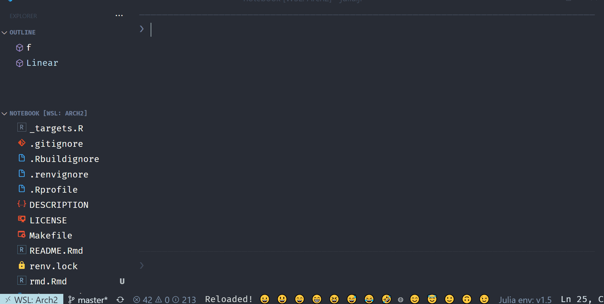
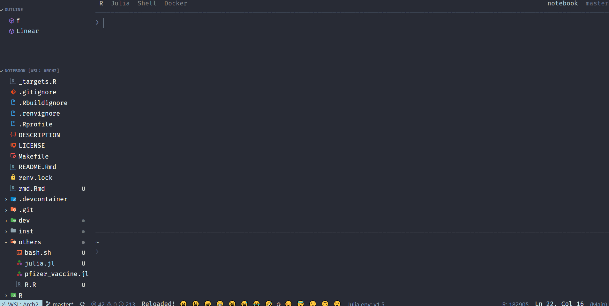
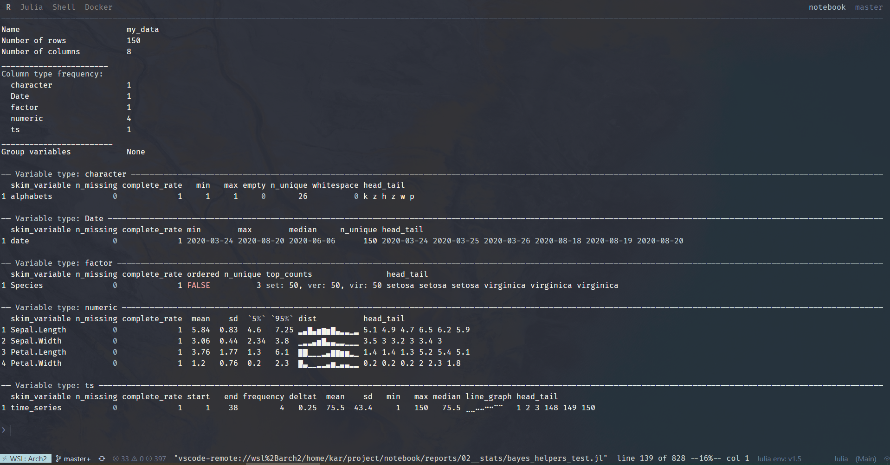
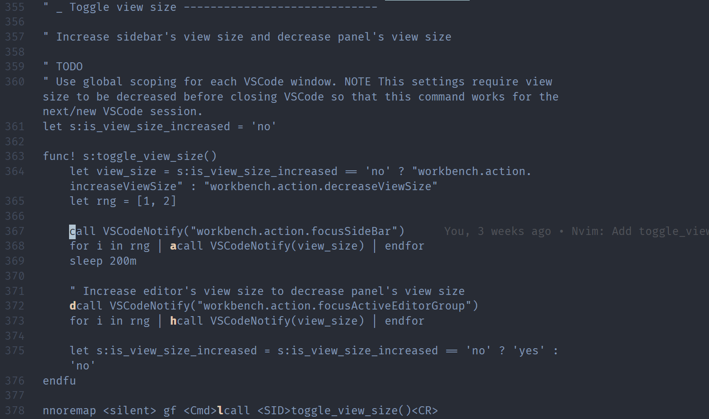
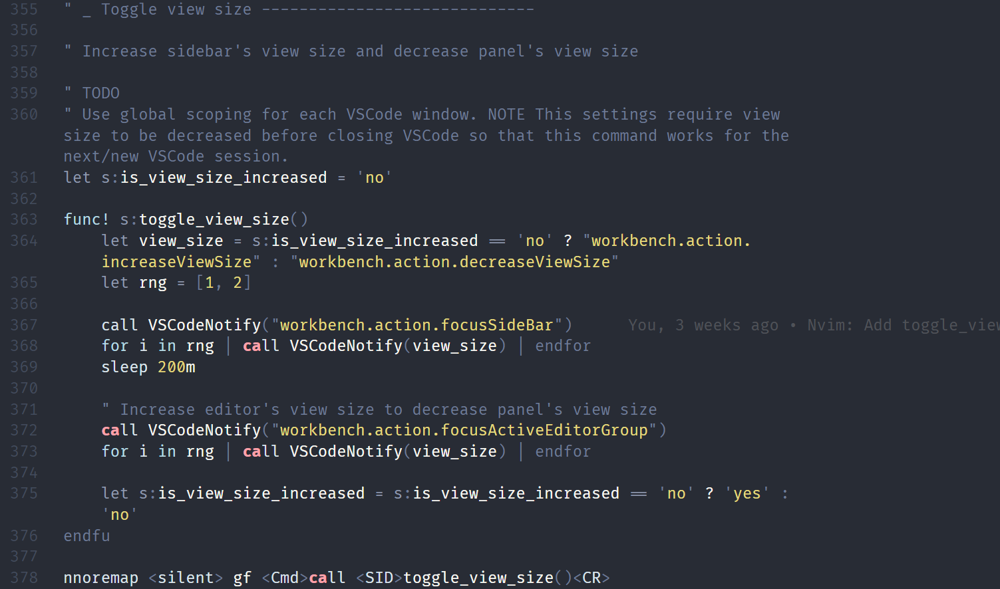

# README

_NOTE Draft only...many TODOs._

My _minimalist_ setup for theme & some of my productivity tools for
- VSCode
- Vim via [VSCode Neovim](https://marketplace.visualstudio.com/items?itemName=asvetliakov.vscode-neovim)
- Tmux
- R REPL [{radian}](https://github.com/randy3k/radian)
- R REPL terminal output [{colorout}](https://github.com/jalvesaq/colorout)
- Julia REPL
- {theme} for R packages: {ggplot2}, {plotly}, {shiny}, {rmarkdown}, {ggdist}, {ggdag}, etc

_Minimalistic_ style. All colors are _chosen & hand tuned manually with love_
- Dark background
- 3 light colors: matching colors and good contrast for plots
- Dark colors for everything else e.g. comments, operators, brackets, quotes
- Consistent styles for everything mentioned above

Syntax highlighting styles
- Focus on keywords with minimal visual noise
- Customized for R, Julia, Vimscript, etc


NOTE
- Some of these files (e.g. .Rprofile, startup.jl) only work together with VSCode's theme
- I setup all these mainly for my personal use, hence may contain specific customizations and _'hacks'_
- Feel free to pick what you want

# Gallery






# VSCode theme

Image as above. See [minimalist-vscode](https://github.com/kar9222/minimalist-vscode)

## Custom VSCode CSS

### customize-ui

Install [customize-ui](https://marketplace.visualstudio.com/items?itemName=iocave.customize-ui) and [copy this](https://github.com/kar9222/minimalist/blob/main/vscode/vscode.css) and in settings.json


<details>
<summary>Theme</summary>

```json
{
    "vscode_custom_css.policy": true,
    "vscode_custom_css.imports": ["/path/to/vscode.css"],
}
```

</details>
<br>

### Custom CSS and JS Loader

Install [Custom CSS and JS Loader](https://marketplace.visualstudio.com/items?itemName=be5invis.vscode-custom-css)


<details>
<summary>Theme</summary>

```json
{
  // Sample only. Use any size you want.
  "customizeUI.listRowHeight": 28, // optionally, try 29
  "customizeUI.fontSizeMap": {
    "13px": "16px",
    "12px": "16px",
  },
}
```

</details>
<br>

# R terminal output

See [My {colorout}](https://gist.github.com/kar9222/0e1130c15bfaba3a71f0cf6d1d08931f)




# Theme & productivity tools

NOTE
- This section contains _very hacky_ ways of editing the source files. Use at your own risks.
- TODO Pull requests or rebase the repo, etc
- Some of them are TODO and the hacks can be avoided

```bash
git clone git@github.com:kar9222/minimalist.git && cd minimalist
minimalist=`pwd`
```


# {vscode-R}

<details>
<summary>Theme</summary>

```bash
# NOTE Manually alias your VSCode extensions directory e.g.
$vsc=~/.vscode/extensions
vsc_r=$(ls --color=never $vsc | grep ikuyadeu.r)
ln -sf vscode_r/r.json $vsc/$vsc_r/syntax/r.json
```

</details>
<br>


# R REPL {radian}

Theme & productivity tools. NOTE I pin the {radian} version at `pip install -I radian==0.4.7`

## FZF & R history search

<details>
<summary>FZF + R history search</summary>
<br>
Call [FZF](https://github.com/junegunn/fzf) for interactive R history search. Great for single-line history search and can be used together with native {radian} REPL's `ctrl+r` multi-line history search.

1. Put this in e.g. `~/bin/r_history` then `chmod +x ~/bin/r_history`
2. Call FZF in Tmux for running this script

~/bin/r_history

```bash
#! /bin/bash

# R history: Remove duplicates, commented lines, blank lines, starting `+` symbol
# NOTE the location of your ~/.radian_history. Should be the default.
tac ~/.radian_history                    | \
    awk '!a[$0]++'                       | \
    sed -e '/^#/d  ;  /^$/d  ;  s/^+//g' | \
    FZF --exact --no-sort
```

~/.tmux.conf

```bash
bind -n MY_KEYBINDING run " \
    tmux split-window -p 75 \
    'tmux send -t #{pane_id} \
        \"$(~/bin/r_history)\"' \
"
```

</details>
<br>



## {radian} autocompletion & theme

Autocompletion: Type some character, press `right arrow` or other keybindings for completion. NOTE In the GIF below, I use `alt+l` key autocompletion keybindings.

Theme: See image above and in your ~/.radian_profile, simply put `options(radian.color_scheme = "monokai")`.


<details>
<summary>Autocomplete & theme</summary>

```bash
# R REPL {radian} --------------------------------

repl=./radian
radian_proj=$repl/radian
latest_conda=/opt/$(ls --color=never /opt | grep miniconda | tail -1)
latest_py=$(ls --color=never $latest_conda/lib | grep python | tail -1)
site_packages=$latest_conda/lib/$latest_py/site-packages

# {radian}
# TODO Use customer lexer
radian=$site_packages/radian
sudo ln -sf $radian_proj/lexer.py      $radian/lexer.py
sudo ln -sf $radian_proj/completion.py $radian/completion.py
sudo ln -sf $radian_proj/session.py    $radian/session.py

# {pygments}
# TODO https://pbelmans.ncag.info/blog/2011/03/06/how-to-change-pygments-styles-and-a-university-of-antwerp-style/
# https://stackoverflow.com/questions/25368222/pygments-style-not-found
# https://github.com/pbelmans/ua-pygments-style
sudo ln -sf $repl/pygments/styles/monokai.py $site_packages/pygments/styles/monokai.py

# {prompt_toolkit}
sudo ln -sf $repl/prompt_toolkit/styles/defaults.py $site_packages/lineedit/deps/prompt_toolkit/styles/defaults.py
```

</details>
<br>





# R theme package

{theme} for R packages: {ggplot2}, {plotly}, {shiny}, {rmarkdown}, {ggdist}, {ggdag}, etc.

See [{theme}](https://github.com/kar9222/theme)


# Custom {skimr} summary stats

See [Custom {skimr} summary stats](https://gist.github.com/kar9222/c9c0c55d01ce88bbc3a96981e71b7cae)




# Julia

Theme for Julia REPL. See image above and [startup.jl](https://github.com/kar9222/minimalist/blob/main/julia/startup.jl)

# Vim

Theme for [{vim-sneak}](https://github.com/justinmk/vim-sneak) & [{vim-easymotion}](https://github.com/easymotion/vim-easymotion). See image above and [init.vim](https://github.com/kar9222/minimalist/blob/main/vim/init.vim)

{vim-easymotion}



{vim-sneak}




# Tmux

Theme for status bar, pane, window and search bar. See image above and [.tmux.conf](https://github.com/kar9222/minimalist/blob/main/tmux/.tmux.conf)
